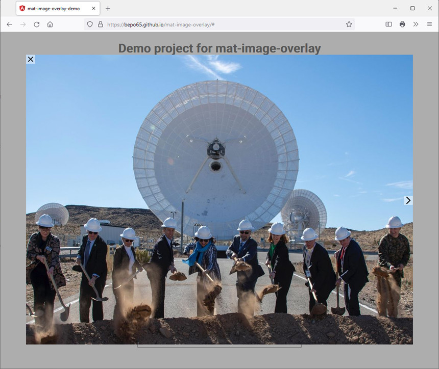

# Mat-Image-Overlay

[](https://github.com/kefranabg/readme-md-generator/blob/master/LICENSE)

An [Angular Material](https://material.angular.io/) based component that shows images in an overlay.
The component is based on Rafasantos [angular-material-image-overlay](https://github.com/rafasantos/angular-material-image-overlay).

## Demo
 Try out the [demo page](https://bepo65.github.io/mat-image-overlay/)



## Quick Start
Install the package:

```
npm install mat-image-overlay
```

Configure your angular application module (e.g: `app.module.ts`):
```
...
import { MatImageOverlayModule } from 'mat-image-overlay';

@NgModule({
  ...
  imports: [
    ...
    MatImageOverlayModule
  ]
})
export class AppModule { }
```

Define a function to open the images in your application component (e.g. `app.component.ts`)
```
images = [
    'https://www.jpl.nasa.gov/spaceimages/images/wallpaper/PIA23618-1024x768.jpg',
    'https://www.jpl.nasa.gov/spaceimages/images/wallpaper/PIA23761-800x600.jpg',
    'https://www.jpl.nasa.gov/spaceimages/images/wallpaper/PIA23794-800x600.jpg',
    'https://www.jpl.nasa.gov/spaceimages/images/wallpaper/PIA23214-1440x900.jpg'
];

constructor(private imageOverlay: MatImageOverlay) {
}

openImageOverlay(imageIndex?: number): void {
  const config = {
    images: this.images,
    startImageIndex: imageIndex,
    backdropClass: 'demo-backdrop-class'
  } as MatImageOverlayConfig;
  const imageOverlayRef = this.imageOverlay.open(config);
}
```

Open the overlay via a clickable element in your html template (e.g. `app.component.html`)
```html
  <p>
    Click <a href="#" (click)="openImageOverlay()">here to open the overlay</a>
  </p>
```

## Mat-Image-Overlay Demo
Demo project to show case how `mat-image-overlay` works.

```
git clone git@github.com:BePo65/mat-image-overlay.git
cd mat-image-overlay
npm start
```

Navigate to http://localhost:4200

# API reference for Mat-Image-Overlay

## Services
### MatImageOverlay
Service to open Mat-Image-Overlay as modal overlay.

**Properties**
| Name  | Description |
|---|---|
| imageOverlayRef: MatImageOverlayRef &#124; undefined | Reference of the opened image overlay. |
| afterOpened: Subject&lt;MatImaeOverlayRef&gt; | Stream that gets notified when the image overlay has been opened. |
| afterClosed: Subject&lt;number&gt; | Stream that gets notified when the image overlay has been closed. |

**Methods**
| open | |
|---|--|
| Opens the image overlay. | |
| *Parameters* | |
| config<br>MatImageOverlayConfig | Extra configuration options. |
| *Returns* | |
| MatImageOverlayRef | Reference to opened image overlay.

| imageOverlayExists | |
|---|--|
| Checks Whether the image overlay already exists. | |
| *Returns* | |
| boolean | |

## Interfaces
### MatImageOverlayConfig
Configuration for opening a modal image overlay with the MatImageOverlay service.

**Methods**
| urlForImage | |
|---|--|
| Gets the url for an image for one entry of images array. | This function is optional. The default implementation expects 'images' to be an array of strings. |
| *Parameters* | |
| imageData | Data for the image. |
| baseUrl | Url fragment to be used for building the image url. Optional parameter. |
| *Returns* | |
| string | Url for the image to be displayed. |

| descriptionForImage | |
|---|--|
|This method gets called to fetch the image description. | This function is optional. |
| *Parameters* | |
| imageData | Data for the image. |
| configuration | Additional parameters defined as 'descriptionForImageConfiguration' in the MatImageOverlayConfig object. |

**Properties**
| Name  | Description |
|---|---|
| images | Array of the images to display. |
| baseUrl | Base url to be used by method 'urlForImage'.<br>Optional parameter. |
| startImageIndex | Index of the image to be displayed when initializing the image overlay.<br>Optional parameter. |
| backdropClass | CSS class to add to the backdrop, replacing the default backdrop css.<br>Optional parameter. |
| overlayButtonsStyle | Style of the buttons in the image overlay (using enum ElementDisplayStyle: never, onHover, always). Default value: onHover.<br>Optional parameter. |
| descriptionDisplayStyle | Style of the display of the image description in the image overlay (using enum ElementDisplayStyle: never, onHover, always). Default value: never. Requires a property named 'description' in data source.<br>Optional parameter. |
| descriptionDisplayPosition | Position of the display of the image description in the image overlay (using enum ElementDisplayPosition: left, right) when 'descriptionDisplayStyle' is set to 'onHover'. Default value: right. Requires a propert named 'description' in data source.<br>Optional parameter. |
| imageClickHandlerConfiguration | Object with arbitrary data as parameter of the 'imageClickHandler' method.<br>Optional parameter. |
| descriptionForImageConfiguration | Object with arbitrary data as parameter of the 'descriptionForImage' method.<br>Optional parameter. |

## Classes
### MatImageOverlayRef
Reference to an image overlay opened via the MatImageOverlay service.

**Methods**
| close | |
|---|--|
| Closes the image overlay. | |
| *Parameters* | |
| lastImageIndex | Index of the last image displayed in the overlay. |

| afterOpened | |
|---|--|
| Gets an observable that is notified when the image overlay is finished opening. | |
| *Returns* | |
| Observable&lt;void&gt; | |

| afterClosed | |
|---|--|
| Gets an observable that is notified when the image overlay is finished closing. | |
| *Returns* | |
| Observable&lt;number&gt; | Observable returns index of the last image displayed. |

| imageChanged | |
|---|--|
| Gets an observable that is notified when a new image has been selected. | |
| *Returns* | |
| Observable&lt;number&gt; | Observable returns index of the image displayed. |

| imageClicked | |
|---|--|
| Gets an observable that is notified when an image has been clicked. | |
| *Returns* | |
| Observable&lt;ImageClickedEvent&gt; | Observable returns object with data of the clicked image and imageClickedConfiguration object from the config object. |

| keydownEvents | |
|---|--|
| Gets an observable that is notified when keydown events are targeted on the overlay. | |
| *Returns* | |
| Observable&lt;number&gt; | Observable returns index of the image displayed. |

### MatImageOverlayComponent
Component used by MatImageOverlay to display the images in the modal overlay.

**Methods**
| gotoNextImage | |
|---|--|
| Display the next image in the datasource. | |

| gotoPreviousImage | |
|---|--|
| Display the previous image in the datasource. | |

| gotoFirstImage | |
|---|--|
| Display the first image in the datasource. | |

| gotoLastImage | |
|---|--|
| Display the last image in the datasource. | |

| gotoImage | |
|---|--|
| Display the image in the datasource selected by the imageIndex. | |
| *Parameters* | |
| imageIndex | Index of the image to be displayed. |

# API reference for Mat-Image-Overlay testing

```typescript
import { MatImageOverlayHarness } from 'mat-image-overlay/testing';
```
## Classes
### MatImageOverlayHarness extends ContentContainerComponentHarness
Harness for interacting with a standard MatImageOverlay in tests.

**Properties**
| Name  | Description |
|---|---|
| static hostSelector: '.mat-image-overlay-container' | The selector for the host element of a MatImageOverlay instance. |

**Methods**
| async overlayIsLoaded | |
|---|--|
| Gets a flag that is true, when the image overlay is visible. | |
| *Returns* | |
| Promise&lt;boolean&gt; | Flag that shows, if the image overlay is visible.

| async close | |
|---|--|
| Closes the image overlay by pressing escape. | |
| *Returns* | |
| Promise&lt;void&gt; | Promise that resolves when the action completes..

| async clickBackdrop | |
|---|--|
| Closes the image overlay by clicking the backdrop of the image overlay. | |
| *Returns* | |
| Promise&lt;void&gt; | Promise that resolves when the action completes..

| async buttonCloseVisible | |
|---|--|
| Gets a flag that is true, when the 'close' button is visible. | |
| *Returns* | |
| Promise&lt;boolean&gt; | Flag that shows, if the 'close' button is visible.

| async buttonPreviousVisible | |
|---|--|
| Gets a flag that is true, when the 'previous' button is visible. | |
| *Returns* | |
| Promise&lt;boolean&gt; | Flag that shows, if the 'previous' button is visible.

| async buttonNextVisible | |
|---|--|
| Gets a flag that is true, when the 'next' button is visible. | |
| *Returns* | |
| Promise&lt;boolean&gt; | Flag that shows, if the 'next' button is visible.

| async descptionVisible | |
|---|--|
| Gets a flag that is true, when the 'description' of the image is visible. | |
| *Returns* | |
| Promise&lt;boolean&gt; | Flag that shows, if the 'description' is visible.

| async clickCloseButton | |
|---|--|
| Clicks the 'close overlay' button of the image overlay. | |
| *Returns* | |
| Promise&lt;void&gt; | Promise that resolves when the action completes..

| async clickPreviousButton | |
|---|--|
| Clicks the 'goto previous image' button of the image overlay. | |
| *Returns* | |
| Promise&lt;void&gt; | Promise that resolves when the action completes..

| async clickNextButton | |
|---|--|
| Clicks the 'goto next image' button of the image overlay. | |
| *Returns* | |
| Promise&lt;void&gt; | Promise that resolves when the action completes..

| async figureHover | |
|---|--|
| Sets the figure tag of the overlay (the content of the overlay) into the hover state. | |
| *Returns* | |
| Promise&lt;void&gt; | Promise that resolves when the action completes..

| async imageUrl | |
|---|--|
| Gets the url of the current image in the overlay. | |
| *Returns* | |
| Promise&lt;boolean&gt; | Url of the image or empty string.

| async sendKeys | |
|---|--|
| Send keys to the overlay. | |
| *Parameters* | |
| ...keys<br>TestKey[] | Keys to be sent. Posiible values are the arrow keys, the home and the end key. |
| *Returns* | |
| Promise&lt;void&gt; | Promise that resolves when the action completes..

| async hasBackdropClass | |
|---|--|
| Gets a flag that is true, when the backdrop contains the given css class. | |
| *Parameters* | |
| classname<br>string | Name of the css class to be evaluated. |
| *Returns* | |
| Promise&lt;boolean&gt; | Flag that shows, if the backdrop contains the given css class.

# Development
Build the library and the demo project:
```
npm run build
```

Lint the library,  the demo project with eslint and the scss files with stylelint:
```
npm run lint
npm run lint:scss
```

Test the library and the demo project:
```
npm run test
```

Run end to end tests for the demo project with cypress once (e.g. for CI scenarios):
```
npm run e2e
```
The script 'build:ghpages' is used by the github automation to publish the demo to github pages, when the master branch is updated.

## Open issues
  - &minus;

## Used assets
The component is based on Angular Material and uses [Google Fonts](https://fonts.google.com/specimen/Roboto) and [Google Material Icons](https://google.github.io/material-design-icons/#icon-font-for-the-web).
Bith fonts are part of the project and not fetched via https.

Some special icons are stored in the code as strings representing the icons as svg graphics.

## Version hint
* currently no hints (we are on Angular 15)

# Contributing
## Changelog
The project uses 'standard-version' to create the changelog. To enable this system, commit messages are linted before commits are executed by git.

**The structure of commit messages is**:
```
  <header>
  <BLANK LINE>
  <body>
  <BLANK LINE>
  <footer>
```

**header**
```
  <type>(<scope>): <short summary>
```
  
type and scope
  - build: Changes that affect the build system or external dependencies (example scope: npm)
  - docs: Documentation only changes
  - feat: A new feature
  - fix: A bug fix
  - perf: A code change that improves performance
  - refactor: A code change that neither fixes a bug nor adds a feature
  - test: Adding missing tests or correcting existing tests (example scopes: demo, lib, e2e)

**footer**
```
  BREAKING CHANGE: ... (requires MAJOR in Semantic Versioning)
```

For details of the commit messages format see [Contributing to Angular](https://github.com/angular/angular/blob/master/CONTRIBUTING.md#commit).

# License
The code is released under the [MIT license](LICENSE)
