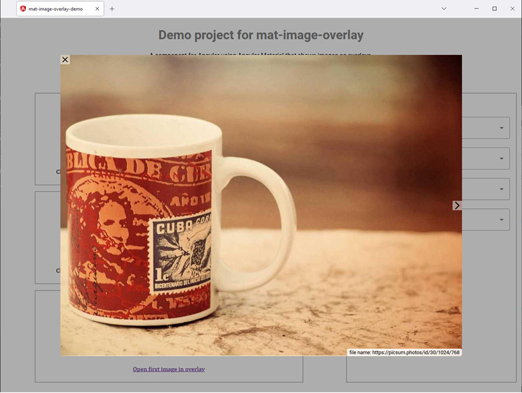

# Mat-Image-Overlay

[](https://github.com/kefranabg/readme-md-generator/blob/master/LICENSE)

An [Angular Material](https://material.angular.io/) based component that shows images in an overlay.
The component is based on Rafasantos [angular-material-image-overlay](https://github.com/rafasantos/angular-material-image-overlay).

## Example


## Quick Start
Install the package:

```
npm install mat-image-overlay
```

Configure your angular application module (e.g: `app.module.ts`):
```
...
import { MatImageOverlayModule } from 'mat-image-overlay';

@NgModule({
  ...
  imports: [
    ...
    MatImageOverlayModule
  ]
})
export class AppModule { }
```

Open the images via `MatImageOverlayService.open`
```
images = [
    'https://www.jpl.nasa.gov/spaceimages/images/wallpaper/PIA23618-1024x768.jpg',
    'https://www.jpl.nasa.gov/spaceimages/images/wallpaper/PIA23761-800x600.jpg',
    'https://www.jpl.nasa.gov/spaceimages/images/wallpaper/PIA23794-800x600.jpg',
    'https://www.jpl.nasa.gov/spaceimages/images/wallpaper/PIA23214-1440x900.jpg'
];

constructor(private imageOverlayService: MatImageOverlayService) {
}

openImageOverlay(): void {
  this.imageOverlayService.open(this.images);
}
```

## Mat-Image-Overlay Demo
Demo project to show case how `mat-image-overlay` works.

```
git clone git@github.com:BePo65/mat-image-overlay.git
cd mat-image-overlay
npm start
```

Navigate to http://localhost:4200

## Development
Build the library and the demo project:
```
npm run build
```

Lint the library,  the demo project with eslint and the scss files with stylelint:
```
npm run lint
npm run lint:scss
```

Test the library and the demo project:
```
npm run test
```

Run end to end tests for the demo project with cypress:
```
npm run cypress:run
```

## Used assets
The component uses [Google Material Icons](https://google.github.io/material-design-icons/#icon-font-for-the-web).
The icons are stored in the code as strings representing the icons as svg graphics.

## Changelog
The project uses 'standard-version' to create the changelog. To enable this system, commit messages are linted before commits are executed by git.

### The structure of commit messages is:
```
  <header>
  <BLANK LINE>
  <body>
  <BLANK LINE>
  <footer>
```

**header**
```
  <type>(<scope>): <short summary>
```
  
type and scope
  - build: Changes that affect the build system or external dependencies (example scope: npm)
  - docs: Documentation only changes
  - feat: A new feature
  - fix: A bug fix
  - perf: A code change that improves performance
  - refactor: A code change that neither fixes a bug nor adds a feature
  - test: Adding missing tests or correcting existing tests (example scopes: demo, lib, e2e)

**footer**
```
  BREAKING CHANGE: ... (requires MAJOR in Semantic Versioning)
```

For details of the commit messages format see [Contributing to Angular](https://github.com/angular/angular/blob/master/CONTRIBUTING.md#commit).

## License
The code is released under the [MIT license](LICENSE)
